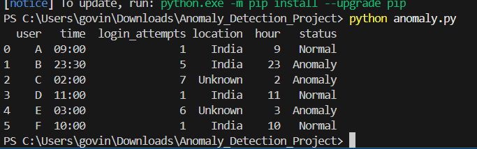

# Log-Based Anomaly Detection

## Project Overview
This project is a log-based anomaly detection system that identifies suspicious activities from login data using rule-based analysis. It checks user login patterns and marks unusual behavior as anomalies.

## Features
- Reads log data from CSV file
- Extracts login hour from time field
- Detects suspicious activity based on simple rules
- Flags abnormal records as "Anomaly"
- Visualizes normal vs anomaly count using a bar chart

## Technologies Used
- Python
- Pandas
- Matplotlib

## Project Files
- `anomaly.py` - main Python script for anomaly detection
- `log_data.csv` - dataset containing log records

## Detection Rules
A record is marked as **Anomaly** if:
- login time is before 6 AM
- login attempts are greater than 4
- location is `Unknown`

Otherwise, it is marked as **Normal**.

## How It Works
1. Load the log dataset
2. Extract hour from login time
3. Apply anomaly detection rules
4. Add status column as Normal or Anomaly
5. Display results
6. Show bar chart of anomaly count

## How to Run
```bash
pip install pandas matplotlib
python anomaly.py


## Output Screenshots

### Output Table


### Output Chart

